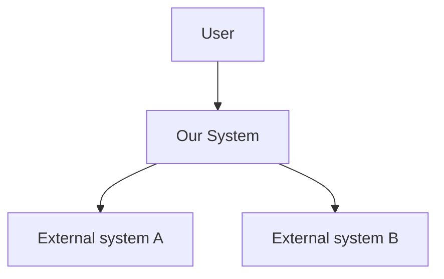

# System Context

## Actors
<Who/what uses the system: user types, admins, external systems.>

## Context diagram (C4 level 1)

## Containers (C4 level 2)
| Container | Responsibility | Tech | Talks to |
|---|---|---|---|
| <web app> | <…> | <…> | <…> |
| <api> | <…> | <…> | <…> |
| <database> | <…> | <…> | <…> |

## Boundaries & integrations
<Trust boundaries, what crosses them, auth between containers, third-party integrations.>
